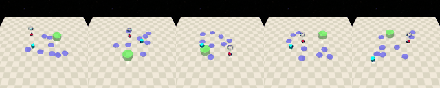
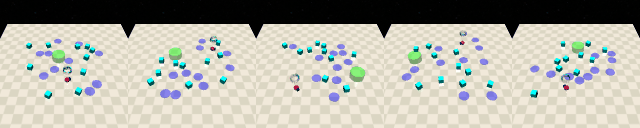
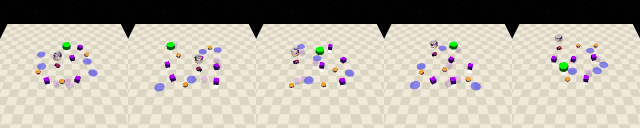
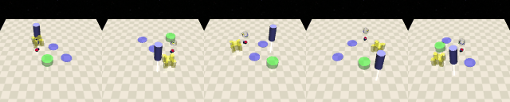
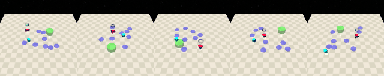
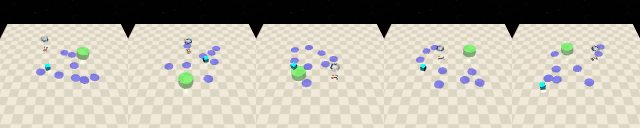
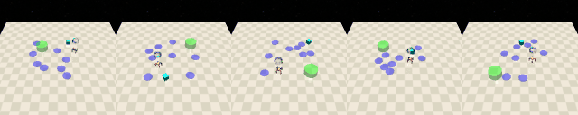

# Safe Planning and Policy Optimization via World Model Learning

## Requirements

- **Python**
- **[miniconda/conda](https://www.anaconda.com/docs/getting-started/miniconda/install#quickstart-install-instructions)**

## Installation

Get started with SPOWL:

1. Create a conda environment:
   ```bash
   conda create -n spowl python==3.10
   ```
2. Activate the environment:
   ```bash
   conda activate spowl
   ```
3. Install Safety Gymnasium
    ```bash
    wget https://github.com/PKU-Alignment/safety-gymnasium/archive/refs/heads/main.zip
    unzip main.zip
    rm -rf main.zip
    pip install -e safety-gymnasium-main
    ```
3. Install jax:
   ```bash
   pip install --no-cache-dir --upgrade pip
   pip install --no-cache-dir --upgrade "jax[cuda12]"
   ```
4. Install other requirements:
   ```bash
   pip install --no-cache-dir hydra-core tabulate wandb tqdm moviepy equinox optax
   ```
5. Install for 'osmesa':
   ```bash
   conda install -c conda-forge mesalib
   ```

6. Fix dependencies:
   ```bash
   pip install --no-cache-dir gymnasium-robotics==1.2.3 numpy==1.25.0
   ```

## Usage

Coming soon

## SPOWL in some tasks

### Point Goal 1


### Point Goal 2


### Point Button 1


### Point Push 1


### Car Goal 1


### Doggo Goal 1


### Ant Goal 1


## Citation

If you use SPOWL in your research, please cite:

```bibtex
@article{latyshev2025spowl,
  title={Safe Planning and Policy Optimization via World Model Learning},
  author={Latyshev, Artem and Gorbov, Gregory and Panov, Aleksandr I.},
  journal={arXiv preprint arXiv:2506.04828},
  year={2025}
}